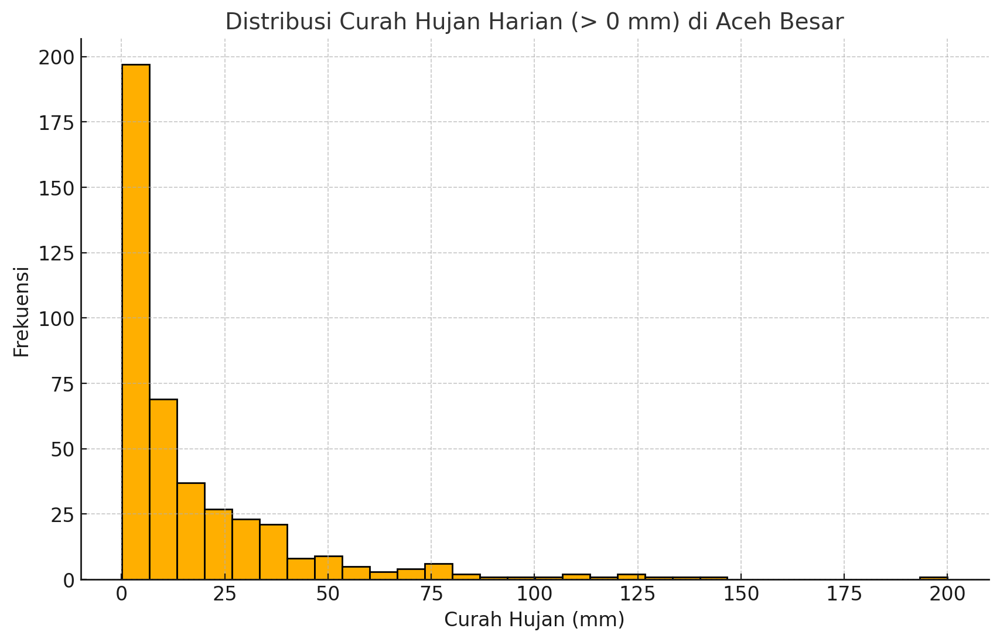
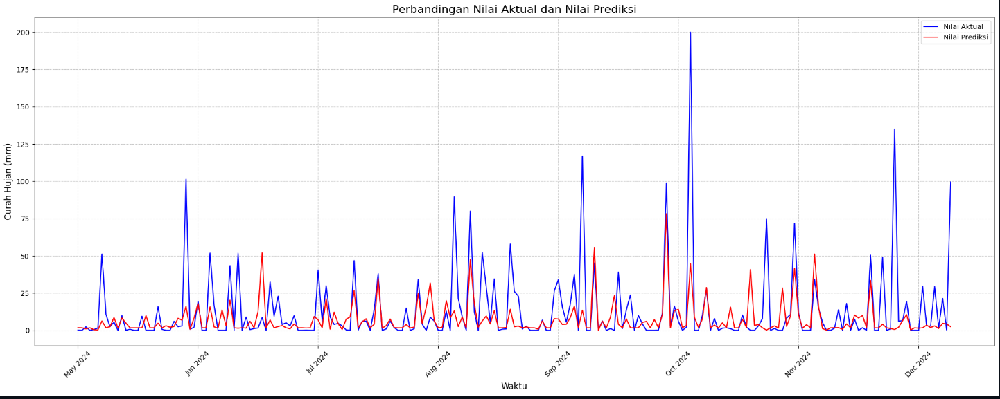
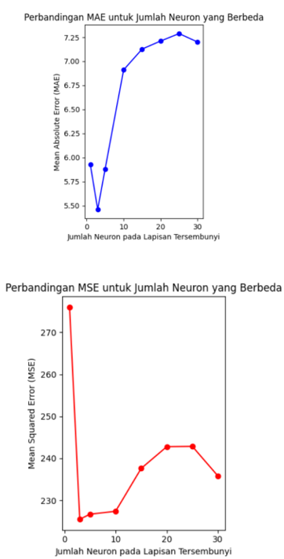
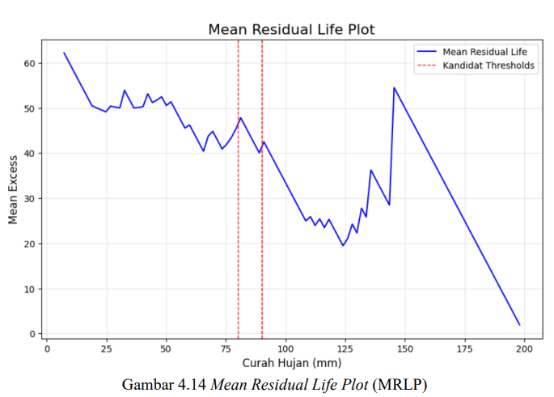
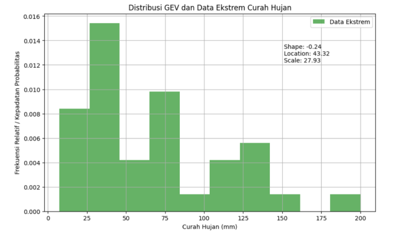
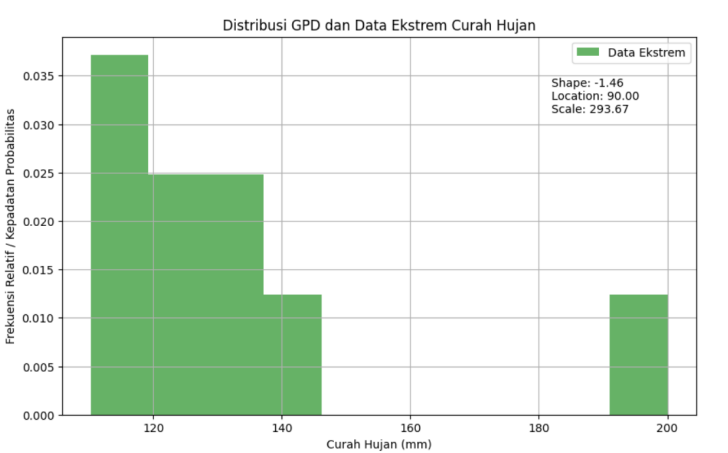

# Flood Risk Analysis & Rainfall Forecasting

A quantitative rainfall analysis for **Aceh Besar, Indonesia**, combining **Extreme Learning Machine (ELM)** forecasting, **Extreme Value Theory (EVT)**, and **Value at Risk (VaR)** to analyze rainfall patterns, extreme events, and potential rainfall risk.

> **Research Project — Undergraduate Thesis, Universitas Syiah Kuala (2025)**

**Research Title:**
_Estimation of Flood Risk Level Using Extreme Learning Machine and Extreme Value Theory (Case Study: Aceh Besar Regency)_

---

## Project Overview

Extreme rainfall is an important factor associated with flood risk. This research analyzes historical daily rainfall observations in **Aceh Besar Regency** and applies machine learning and statistical extreme-value methods to understand both typical rainfall behavior and unusually high rainfall events.

The project combines three analytical approaches:

- **Extreme Learning Machine (ELM)** — forecasts rainfall using lagged rainfall observations.
- **Extreme Value Theory (EVT)** — models extreme rainfall using GEV and GPD distributions.
- **Value at Risk (VaR)** — estimates rainfall levels corresponding to selected confidence levels.

The overall objective is to connect **rainfall forecasting, extreme-event modeling, and quantitative risk estimation** within a single analytical workflow.

---

## Research Questions

This research addresses three main questions:

1. How accurately can rainfall in Aceh Besar be forecast using an Extreme Learning Machine?
2. How can Extreme Value Theory be used to identify and model extreme rainfall events?
3. What rainfall levels are estimated under different confidence levels using Value at Risk?

---

## Dataset

### Rainfall Observations

The study uses daily rainfall observations from the **Sultan Iskandar Muda Meteorological Station**, covering **January 2022 to December 2024**.

| Attribute          | Description                   |
| ------------------ | ----------------------------- |
| Study Area         | Aceh Besar Regency, Indonesia |
| Observation Period | January 2022 – December 2024  |
| Frequency          | Daily                         |
| Observations       | 1,096                         |
| Data Source        | BMKG                          |
| Format             | Excel / CSV                   |



_Figure 1. Distribution of daily rainfall observations._

---

## Methodology

The research follows the workflow below:

```text
Daily Rainfall Data
        │
        ▼
Data Preprocessing
        │
        ▼
Lag Feature Engineering
        │
        ▼
Train / Test Split
        │
        ▼
Extreme Learning Machine
        │
        ├── MAE
        └── MSE
        │
        ▼
Extreme Rainfall Analysis
        │
        ├── Block Maxima → GEV
        │
        └── Peaks Over Threshold → GPD
        │
        ▼
Kolmogorov–Smirnov Test
        │
        ▼
Value at Risk
        │
        ▼
Rainfall Risk Estimates
```

---

# 1. Data Preparation

The original dataset contains daily rainfall observations. The preprocessing workflow included:

- Converting rainfall measurements to numeric format
- Converting dates to datetime format
- Identifying and handling missing observations
- Creating lagged rainfall features
- Preparing the time-series dataset for forecasting

Two lag features were used:

- `Lag-1` — rainfall from the previous observation
- `Lag-2` — rainfall from two observations earlier

These lagged observations were used as input variables for the ELM forecasting model.

---

# 2. Rainfall Forecasting with Extreme Learning Machine

## Model

The forecasting component uses an **Extreme Learning Machine (ELM)**, a single-hidden-layer neural network in which hidden-layer weights and biases are randomly initialized and the output weights are determined analytically using the **Moore–Penrose pseudoinverse**.

The model architecture can be summarized as:

```text
Lag-1 ─┐
       ├──► Hidden Layer ───► Rainfall Prediction
Lag-2 ─┘
```

A **ReLU activation function** was used in the hidden layer.

## Model Evaluation

Multiple hidden-layer configurations were evaluated:

```text
1, 3, 5, 10, 15, 20, 25, 30 neurons
```

Performance was measured using:

- **Mean Absolute Error (MAE)**
- **Mean Squared Error (MSE)**

### Initial Evaluation

| Hidden Neurons |        MSE |      MAE |
| -------------: | ---------: | -------: |
|              1 |     276.01 | **5.92** |
|              3 | **225.50** |     5.46 |
|              5 | **225.50** |     5.88 |
|             10 |     226.72 |     6.91 |
|             15 |     227.41 |     7.13 |
|             20 |     237.61 |     7.21 |
|             25 |     242.86 |     7.29 |
|             30 |     235.81 |     7.20 |

Because ELM uses random initialization, repeated experiments were performed to examine the stability of model performance.

The repeated evaluation indicated that:

- The **1-neuron configuration** consistently produced the lowest MAE.
- The **5-neuron configuration** produced the lowest MSE in the repeated evaluation.
- Increasing the number of hidden neurons did not consistently improve forecasting performance.
- The best MAE across repeated experiments was approximately **5.83–5.94 mm**.

### Actual vs Predicted Rainfall



_Figure 2. Comparison between observed and ELM-predicted rainfall._

### ELM Error Analysis



_Figure 3. MAE and MSE across different hidden-layer configurations._

---

# 3. Extreme Value Theory

While forecasting evaluates expected rainfall behavior, extreme-value analysis focuses specifically on unusually high rainfall observations.

Two complementary EVT approaches were applied:

1. **Generalized Extreme Value (GEV)** using monthly block maxima
2. **Generalized Pareto Distribution (GPD)** using Peaks Over Threshold (POT)

---

## 3.1 Threshold Selection

For the POT approach, a **Mean Residual Life (MRL) plot** was used to investigate an appropriate threshold for identifying extreme rainfall observations.

The candidate threshold region was approximately **80–90 mm**, with **90 mm** selected as the working threshold.



_Figure 4. Mean Residual Life plot used to investigate the GPD threshold._

Observations exceeding 90 mm were subsequently treated as extreme rainfall events for the GPD analysis.

---

## 3.2 Generalized Extreme Value — GEV

The **Block Maxima** approach was used to extract the maximum rainfall observation from each month.

These monthly maxima were then modeled using a **Generalized Extreme Value (GEV)** distribution.

### Estimated Parameters

| Parameter    |    Value |
| ------------ | -------: |
| Location     |    43.32 |
| Scale        |    27.93 |
| Shape        |    -0.24 |
| KS Statistic |     0.10 |
| KS p-value   | **0.79** |



_Figure 5. GEV distribution fitted to monthly rainfall maxima._

The Kolmogorov–Smirnov test produced a p-value of **0.79** under the study's testing framework.

---

## 3.3 Generalized Pareto Distribution — GPD

The **Peaks Over Threshold (POT)** approach was used to model rainfall observations exceeding the selected **90 mm threshold**.

### Estimated Parameters

| Parameter    |    Value |
| ------------ | -------: |
| Threshold    |    90 mm |
| Scale        |   293.67 |
| Shape        |    -1.46 |
| KS Statistic |     0.42 |
| KS p-value   | **0.06** |



_Figure 6. GPD fitted to rainfall exceedances above the 90 mm threshold._

The KS p-value of **0.06** is slightly above the 0.05 significance level used in the research, so the fitted GPD was considered compatible with the observed exceedances under the study's testing framework.

---

# 4. Value at Risk

The final stage translated the extreme-value models into quantitative rainfall risk estimates.

VaR estimates were calculated at:

- **90% confidence**
- **95% confidence**
- **99% confidence**

## GEV vs GPD

| Confidence Level |      GEV |       GPD |
| ---------------: | -------: | --------: |
|              90% | 64.40 mm | 261.04 mm |
|              95% | 70.22 mm | 263.29 mm |
|              99% | 78.95 mm | 264.89 mm |

The two approaches represent different aspects of extreme rainfall:

- **GEV** models the maximum rainfall observed within each monthly block.
- **GPD** models rainfall exceedances above the selected 90 mm threshold.

Consequently, the resulting estimates differ substantially because the models are based on different representations of the rainfall distribution.

---

# 5. Key Findings

### 1. Greater model complexity did not consistently improve forecasting

Increasing the number of ELM hidden neurons did not consistently reduce forecasting error. The repeated experiments showed that relatively simple configurations could perform competitively with more complex configurations.

### 2. Forecasting and extreme-value analysis serve different purposes

Forecasting metrics such as MAE and MSE describe predictive performance, but they do not fully characterize rare extreme rainfall events. EVT provides a separate framework for studying the upper tail of the distribution.

### 3. GEV and GPD provide complementary perspectives

The two EVT approaches analyze different representations of extreme rainfall:

- **GEV → monthly block maxima**
- **GPD → threshold exceedances**

Using both approaches provides complementary information about extreme rainfall behavior.

### 4. Estimated risk levels increase with confidence

For both EVT approaches, the estimated VaR increases as the confidence level moves from **90% to 99%**, representing increasingly severe rainfall scenarios under the fitted models.

---

# 6. Limitations

The results should be interpreted within the limitations of the study:

- The dataset covers approximately **three years** of rainfall observations.
- The forecasting model uses only **two lagged rainfall variables**.
- Additional meteorological variables such as temperature, humidity, wind, and atmospheric pressure were not included.
- ELM performance can vary because of its random initialization.
- EVT results depend on the selected distribution, modeling approach, and threshold.
- VaR estimates represent **rainfall extremes**, rather than a complete physical hydrological flood model.
- The study does not directly model river discharge, drainage capacity, topography, land use, or other physical flood mechanisms.

Future research could extend the observation period, incorporate additional meteorological and hydrological variables, and compare ELM with other forecasting approaches such as **RNNs and LSTMs**.

---

# 7. Tools & Technologies

### Programming & Analysis

- Python 3.13.1
- Pandas
- NumPy
- SciPy
- Scikit-learn
- Matplotlib
- Microsoft Excel
- Visual Studio Code

### Statistical & Machine Learning Methods

- Time-series analysis
- Data preprocessing
- Lag feature engineering
- Extreme Learning Machine
- ReLU activation
- Mean Absolute Error
- Mean Squared Error
- Extreme Value Theory
- Generalized Extreme Value (GEV)
- Generalized Pareto Distribution (GPD)
- Block Maxima
- Peaks Over Threshold (POT)
- Mean Residual Life analysis
- Maximum Likelihood Estimation
- Kolmogorov–Smirnov test
- Value at Risk (VaR)

---

# 8. Repository Structure

```text
Flood-Risk-Analysis/
│
├── assets/
│   ├── rainfall_distribution.png
│   ├── actual_vs_predicted.png
│   ├── elm_error_comparison.png
│   ├── mean_residual_life.png
│   ├── gev_distribution.png
│   └── gpd_distribution.png
│
├── data/
│   └── rainfall_datasets_monthly/
│
├── notebooks/
│   └── analysis_notebook/
│
├── research_manuscript/
│
└── README.md
```

> Repository structure may be updated as additional analysis files, notebooks, and documentation are added.

---

# 9. Research Context

This project was developed as an **undergraduate thesis** for the **Bachelor of Mathematics program, Universitas Syiah Kuala**.

### Research Title

> _Estimation of Flood Risk Level Using Extreme Learning Machine and Extreme Value Theory (Case Study: Aceh Besar Regency)_

**Author:** Muhammad Rusqi Ash Shiddieqy
**Program:** Bachelor of Mathematics
**Institution:** Universitas Syiah Kuala
**Year:** 2025

---

# 10. What I Learned

This project provided end-to-end experience in quantitative data analysis, from raw data preparation to statistical modeling and interpretation.

Key skills developed include:

- Preparing and cleaning real-world time-series data
- Engineering lag-based features
- Building and evaluating a machine learning model
- Comparing model configurations using quantitative metrics
- Analyzing extreme observations
- Selecting thresholds for tail analysis
- Fitting probability distributions
- Evaluating statistical goodness of fit
- Translating statistical models into quantitative risk estimates
- Communicating technical findings in a practical context

One of the main lessons from the project was that **model complexity should be evaluated against the analytical objective rather than assumed to improve performance automatically**.

---

# 11. Research Manuscript

The Partial research manuscript is included in the repository under:

[Flood-Risk-Analysis](research_manuscript/)

### Citation

**Muhammad Rusqi Ash Shiddieqy.**
_Estimation of Flood Risk Level Using Extreme Learning Machine and Extreme Value Theory (Case Study: Aceh Besar Regency)._
Bachelor's Thesis, Department of Mathematics, Faculty of Mathematics and Natural Sciences, Universitas Syiah Kuala, 2025.

---

## Author

**Muhammad Rusqi Ash Shiddieqy**

Mathematics graduate interested in **Data Analytics, Statistical Modeling, Machine Learning, and Risk Analysis**.

- LinkedIn: https://www.linkedin.com/in/muhammadrusqi/
- GitHub: https://github.com/rusqi
